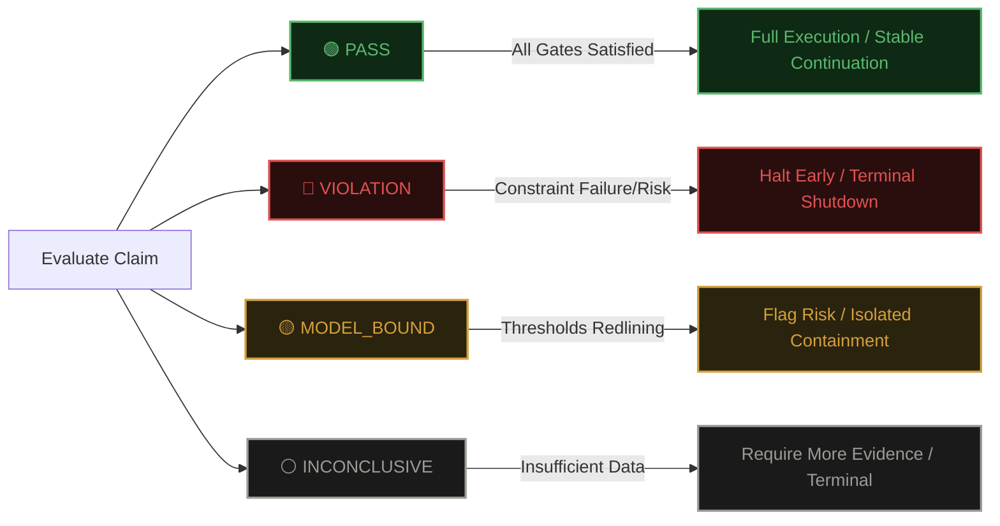

<div align="center">

# VERITAS Ω-CODE v2.0

[](#)
[](#)
[](#)
[](#)

*The Crown Jewel repository showcasing the VERITAS Ω-CODE v2.0 deterministic software verification layer.*

> 👉 **[VIEW THE LIVE DASHBOARD AND HTML SPECIFICATIONS HERE](https://vrtxomega.github.io/VERITAS-Omega-CODE/)** 👈

</div>

---

> **This system decides whether software should be trusted.**
> 
> It evaluates a claim across 10 structural enforcement gates.  
> If any gate fails &rarr; execution halts immediately.  
> If all pass &rarr; the result is cryptographically sealed with a reproducible trace.

**Example:**
```text
auth-api v0.3.0

Gate 8: SECURITY
→ SECRET_DETECTED

Result:
VIOLATION (execution halted)
```
*This would have prevented shipping a compromised authentication system.*

---

## 🛠️ How it's used

1. **Define a BuildClaim** (what your system asserts is true).
2. **Run it through the 10-gate pipeline.**
3. **The system returns:** `PASS`, `VIOLATION`, `MODEL_BOUND`, or `INCONCLUSIVE`.
4. **If `PASS`** &rarr; the result is sealed and your software is deployed.

---

## ⚡ What this actually does (The "Why")

**What this is:**
A deterministic verification protocol that evaluates software claims across 10 structural enforcement gates.

**What it does:**
It decides whether a system can actually be trusted. It enforces a strict terminal outcome: `PASS`, `VIOLATION`, `MODEL_BOUND`, or `INCONCLUSIVE`.

**What makes it different:**
It halts immediately on failure, mandates mathematically independent evidence, and guarantees an immutable, cryptographic execution trace on out S.E.A.L. Ledger.

---

## 🚦 The Visual Flow (The API of Trust)

Every pipeline execution maps directly to a strict terminal outcome. There is no gray area.



### 👉 Real-World Examples

**1. `auth-api` v0.3.0 &rarr; 🔴 VIOLATION**
> Gate 8: SECURITY detected a hardcoded secret in the build manifest. The pipeline halted instantly. The system was shut down before deployment.

**2. `pricing-engine` v1.2.4 &rarr; 🟡 MODEL_BOUND**
> Gate 9: ADVERSARY fuzzing revealed that a 15% perturbation in bounds degraded 30% of the cost paths over threshold. The pipeline flagged the fragility risk and forced isolated containment. 

**3. `ml-pipeline` v4.0.1 &rarr; ⚪ INCONCLUSIVE**
> Gate 4: EVIDENCE found that 3 independent sources were required, but only 2 were provided (`K < 3`). Quality could not be established. The system required more evidence to proceed.

---

## 🧾 Final Verdict

> ### THIS IS NO LONGER A SYSTEM IN DEVELOPMENT.
>
> THIS IS A SYSTEM THAT HAS DEMONSTRATED:
> - **CORRECTNESS**  
> - **DISCIPLINE**  
> - **HONESTY**  
> - **REPRODUCIBILITY**

---

## 🛑 What this prevents

- Shipping code with hidden secrets
- Passing tests but failing under perturbation
- Trusting single-source or biased evidence
- Silent cost or threshold overruns
- Undetected supply chain risk

---

## 🏛️ System Architecture

**VERITAS Ω-CODE v2.0** is the canonical verification protocol for the VERITAS ecosystem. It enforces its strict, 10-gate evaluation pipeline powered by the Sovereign Session Protocol and the `omega-brain-mcp`.

> "If it cannot be expressed as typed, declared, constraint-bound assertions with artifact evidence, it cannot be evaluated."

This repository serves as the definitive source of truth for the v2.0 framework, containing the canonical specifications, full execution traces, and high-fidelity HTML/MD documentation artifacts.

---

## ✨ The 10-Gate Deterministic Pipeline

The core mechanism of VERITAS is the **10-Gate Pipeline**. Every BuildClaim must pass sequentially through these structural enforcement gates. A failure at any gate halts pipeline execution.


### Quick Start / Reference Evaluators

To immediately experiment with the protocol, see the following public endpoints:

- **JSON Schema Definition:** [`schemas/buildclaim.schema.json`](file:///schemas/buildclaim.schema.json) &rarr; The canonical JSON schema mapped directly from the CLAEG specification.
- **Reference Parser CLI:** [`bin/veritas_stub.py`](file:///bin/veritas_stub.py) &rarr; A lightweight Python CLI stub demonstrating how INTAKE handles structural parsing, canonicalization, and hashing.

```bash
# Test a theoretical claim through the INTAKE gate
python bin/veritas_stub.py ./path/to/mock_claim.json
```

---

| # | Gate Name | Enforcement Focus | Status |
|---|------------|-------------------|---------|
| **1** | **INTAKE** | Parse, validate, and canonicalize the BuildClaim. | Enforced |
| **2** | **TYPE** | Validate type safety, unit consistency, and symbol resolution. | Enforced |
| **3** | **DEPENDENCY**| Supply chain verification and CVE dependency depth scanning. | Enforced |
| **4** | **EVIDENCE** | Evaluate the quality, independence, and agreement of evidence. | Enforced |
| **5** | **MATH** | Verify that declared constraints are satisfiable given the evidence. | Enforced |
| **6** | **COST** | Verify resource consumption is within declared bounds. | Enforced |
| **7** | **INCENTIVE** | Detect evidence source dominance and vendor concentration. | Enforced |
| **8** | **SECURITY** | Dedicated security posture evaluation (SAST, secrets, TLS). | Enforced |
| **9** | **ADVERSARY** | Hostile verification (Fuzz, mutate, exploit, stress-test). | Enforced |
| **10**| **TRACE/SEAL**| Compute the cryptographic seal over the entire pipeline run. | Enforced |

---

## 📄 Canonical Artifacts

This repository tracks the immutable specification and reports of the VERITAS Ω-CODE core:

- **`VERITAS_OMEGA_CODE_v2.0.html`**: Premium HTML rendition of the v2.0 specification, built with Sovereign Gold (`#C9A84C`) and Obsidian (`#09090B`) aesthetics.
- **`VERITAS_OMEGA_CODE_v2.0.md`**: The raw, machine-readable Markdown canonical specification.
- **`OMEGA_CODE_FULL_RUN_REPORT.html`**: Complete, cryptographically sealed run report generated by the `omega-brain-mcp` execution.
- **`VERITAS_OMEGA_CODE_v1.0.html`/`.md`**: Legacy specifications preserved for cryptographic lineage and trace verification.

---

## 🛡️ The API of Trust (Verdicts)

Right now, trust is implied. VERITAS makes it explicit. Every evaluation resolves to one of four CLAEG terminal states:

### 🟢 `PASS`
All gates satisfied. Artifact is fully verified and deployable under the declared operational regime. -> **STABLE_CONTINUATION**

### 🟡 `MODEL_BOUND`
Gates mathematically pass, but computational resources, coverage, or structural confidence levels are riding the redline. -> **ISOLATED_CONTAINMENT**

### ⚪ `INCONCLUSIVE`
Insufficient evidence independence, structurally low quality, or algorithmic decidability timeouts. The system cannot affirm trust. -> **TERMINAL_SHUTDOWN**

### 🔴 `VIOLATION`
Constraint failure, severe vulnerability, type mismatch, or threshold collapse. The system halted. -> **TERMINAL_SHUTDOWN**

---

## 🚀 Integrations

| Subsystem | Role |
|-----------|------|
| **`omega-brain-mcp`** | Hosts the 10-gate pipeline; exposes evaluation tools; appends `seal` to S.E.A.L. hash chain. |
| **AEGIS-Rewrite** | Receives `VIOLATION` records and applies deterministic code fixes. |
| **Gravity-Omega v2** | Execution host; enforces VTP signature on gate outputs before downstream routing. |
| **S.E.A.L. Ledger** | Append-only chain of cryptographic seal values ensuring state continuity. |

---

<div align="center">
  <br>
  <b>Built by RJ Lopez | VERITAS Framework</b>
</div>
